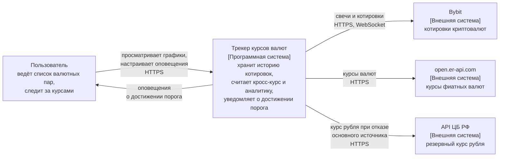
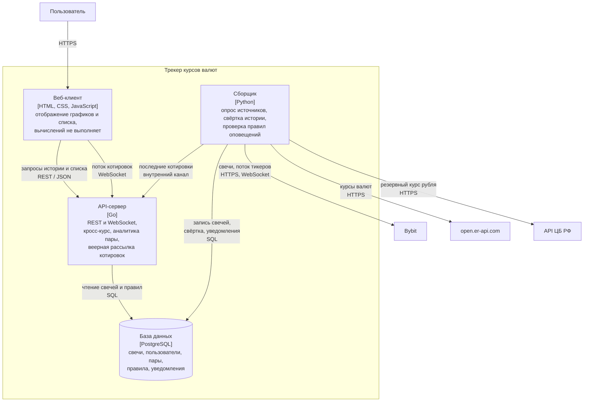
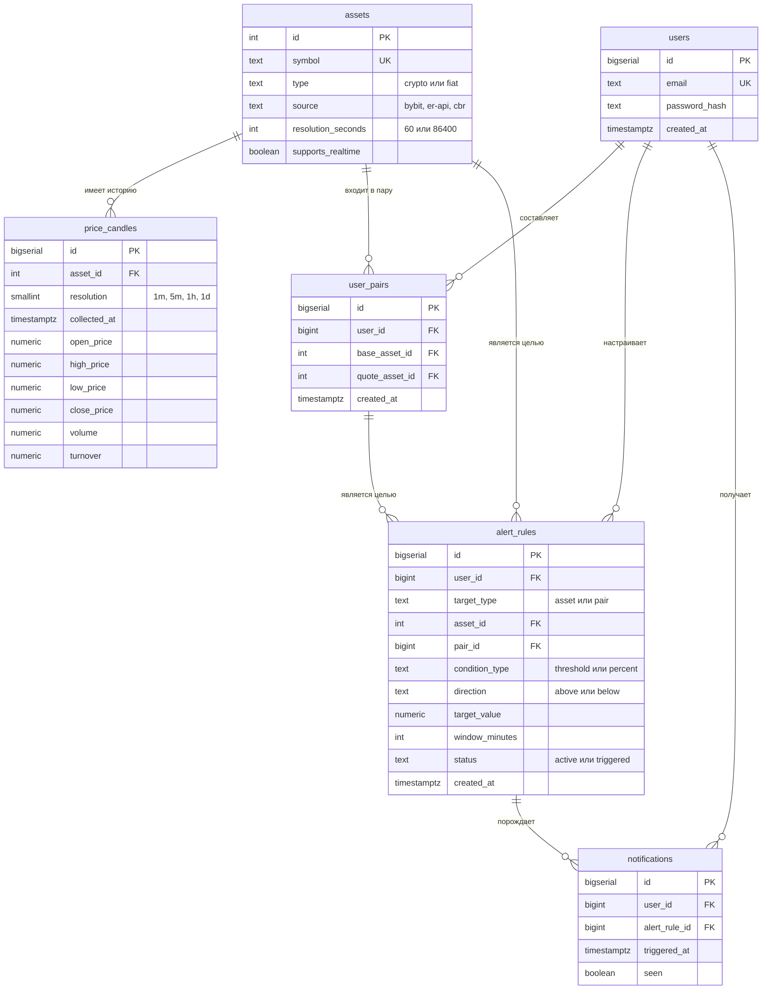

# Трекер курсов валют

**Дисциплина:** конструирование программного обеспечения

## Состав команды

| Участник | Группа |
|---|---|
| Манык Иван | 5130904/40108 |
| Нарумов Дияр | 5130904/40108 |
| Ерофеевский Илья | 5130904/40108 |
| Евдокимов Артем | 5130904/40108 |

## Этап 1. Определение проблемы и формулировка темы

**Проблема.** Пользователь, следящий одновременно за криптовалютами и за курсами обычных валют, вынужден пользоваться разными сервисами и вручную сопоставлять их данные. Курс одного актива относительно другого — особенно когда один из них криптовалюта, а второй обычная валюта — в большинстве сервисов не отображается и требует самостоятельного пересчёта. Набор отслеживаемых пар не сохраняется между сеансами и устройствами.

**Тема.** Веб-сервис «Трекер курсов валют»: персональный список валютных и криптовалютных пар с отображением текущего курса, кросс-курса, истории изменений в виде графика, аналитики по паре и пользовательских оповещений о достижении заданного курса. Поддерживаются как криптовалютные активы, так и обычные (фиатные) валюты, что позволяет составлять пары любого сочетания.

## Этап 2. Выработка требований

### Пользовательские сценарии

Сервер хранит и отдаёт цену каждого актива отдельно, приведённую к единой базе — USDT, а не цену каждой возможной пары. Отслеживание одного актива выражается парой, где вторая сторона — USDT, поэтому отдельного режима для одиночной валюты не требуется.

Активы различаются источником данных и частотой обновления, поэтому эти характеристики задаются в справочнике активов, а не в коде системы:

| Тип | Источник | Частота обновления | Потоковый режим |
|---|---|---|---|
| Криптовалюты | публичное API биржи Bybit | 1 минута | поддерживается |
| Фиатные валюты | публичное API `open.er-api.com` | 1 сутки | не поддерживается |

Ряды разной частоты совмещаются правилом переноса последнего известного значения: значение более редкого ряда берётся по состоянию на момент времени более частого. Это же правило закрывает выходные и праздничные дни, когда котировки фиатных валют не обновляются. Курсы фиатных валют приводятся к USDT по допущению USDT ≈ USD; погрешность около 0,1 % для задач мониторинга признана несущественной.

Разрешение пары определяется тем из двух её активов, который обновляется чаще; период доступен, если он не мельче этого разрешения:

| Состав пары | 1h, 4h | 1d, 1w | Реальное время |
|---|---|---|---|
| Две криптовалюты | доступно | доступно | доступно |
| Криптовалюта и фиатная валюта | доступно | доступно | доступно |
| Две фиатные валюты | недоступно | доступно | недоступно |

Пара из криптовалюты и фиатной валюты сохраняет полную функциональность: её кросс-курс меняется с частотой криптовалютной стороны, а фиатная выступает медленно меняющимся множителем.

**Распределение вычислений.** Клиент выполняет только отображение. Кросс-курс, относительная динамика, аналитика по паре и проверка правил оповещений вычисляются сервером; свёртка истории выполняется сервером как регулярная фоновая задача.

**US-1. Персональный список отслеживания.** Как пользователь, я хочу зарегистрироваться и вести список интересующих меня валютных пар, чтобы не подбирать их заново при каждом обращении к сервису и на разных устройствах.

Критерии приёмки:

- Регистрация выполняется по адресу электронной почты и паролю; адрес уникален, пароль хранится в виде хеша; обращение к защищённым разделам без аутентификации возвращает код 401.
- Пара составляется из двух активов справочника в любом сочетании типов и не может быть добавлена повторно одному пользователю; удаление пары из списка пользователя не затрагивает историю котировок в общем хранилище.
- Для каждой пары отображаются курс, изменение за выбранный период и время последнего обновления; данные помечаются как устаревшие, если обновление не поступало дольше двух интервалов, установленных для типа актива.

**US-2. Анализ курса: история и реальное время.** Как пользователь, я хочу просматривать график выбранной пары с переключением периода (1h, 4h, 1d, 1w, реальное время) и режима отображения, чтобы оценивать динамику курса в требуемом масштабе времени.

Критерии приёмки:

- Смена периода перерисовывает график по данным хранилища без обращения к внешним источникам; сервер отдаёт данные на том уровне детализации, который соответствует периоду. Отсутствие данных за период отображается как пустое состояние.
- Периоды, недоступные для состава пары, отображаются неактивными с пояснением причины, а не скрываются.
- В режиме «Сравнение динамики» сервер возвращает два ряда, которые отображаются отдельными кривыми с независимыми осями Y; при наведении курсора ближайшая кривая выделяется и отображается свечами (OHLC), вторая кривая становится полупрозрачной.
- В режиме «Кросс-курс» сервер выполняет соединение рядов двух активов с переносом последнего известного значения и деление, возвращая один готовый ряд.
- Вкладка «Реальное время» отображает последние 15 минут с обновлением не чаще одного раза в секунду. Поступающие котировки в базу данных не записываются.

**US-3. Оповещения о достижении заданного курса.** Как пользователь, я хочу задавать условие на курс и получать оповещение при его выполнении, чтобы не наблюдать за графиком постоянно.

Критерии приёмки:

- Целью правила является ряд: либо курс отдельного актива в USDT, либо кросс-курс пары. Правило создаётся для той кривой, которая отображается на графике в текущем режиме; отдельный раздел со списком правил служит для их просмотра, изменения и удаления.
- Поддерживаются два типа условия: достижение абсолютного порога («выше», «ниже» заданного значения) и изменение курса более чем на заданный процент за заданный интервал времени.
- Правило хранится в базе данных и действует независимо от наличия открытого сеанса пользователя.
- Проверка выполняется сервером при сохранении каждого нового снимка цены; правило на кросс-курс пересчитывается при поступлении снимка любого из двух активов. Правило с абсолютным порогом считается сработавшим при пересечении порога между двумя соседними снимками, а не при точном совпадении значения с порогом.
- После срабатывания правило переводится в состояние «сработало», оповещение формируется однократно.

**US-4. Аналитика пары.** Как пользователь, я хочу видеть рассчитанные показатели по выбранной паре, чтобы оценивать поведение активов, а не только смотреть на график.

Критерии приёмки:

- За выбранный период отображаются: изменение каждого актива в процентах и разность между ними, коэффициент корреляции активов пары и волатильность каждого актива как стандартное отклонение доходностей.
- Показатели вычисляются сервером по хранимым рядам за выбранный период и возвращаются вместе с данными графика; при смене периода или пары они пересчитываются.
- При недостаточном количестве точек за период вместо значений отображается признак недостаточности данных.

### Масштаб системы

Исходные допущения расчёта:

| Параметр | Обозначение | Значение | Основание |
|---|---|---|---|
| Уникальных пользователей в сутки | `U` | 10 000 | задано условием |
| Сессий на пользователя в сутки | `S` | 2 | типовой профиль использования сервиса мониторинга курсов |
| Длительность сессии | `T` | 300 с | среднее время просмотра дашборда за одно обращение |
| Интервал автообновления списка | `r` | 60 с | периодичность обновления курса на клиенте |
| Обращений за историей за сессию | `h` | 2 | первичная загрузка графика и одна смена периода |
| Доля пользователей, изменяющих список за сутки | `f` | 0,2 | доля активно редактирующих список пользователей |
| Изменений списка у этой группы | `e` | 1,5 | среднее число операций добавления и удаления за сутки |
| Коэффициент пиковой нагрузки | `k` | 4 | отношение пиковой часовой нагрузки к средней |
| Криптовалютных активов в каталоге | `Ac` | 30 | число отслеживаемых криптовалют |
| Фиатных валют в каталоге | `Af` | 10 | число отслеживаемых обычных валют |
| Интервал опроса биржи | `pc` | 60 с | периодичность обновления криптовалютных котировок |
| Интервал опроса источника фиатных курсов | `pf` | 24 ч | периодичность публикации курсов источником |
| Среднее число пар в списке пользователя | `W` | 5 | типовой размер персонального списка |
| Доля пользователей с правилами оповещений | `g` | 0,2 | доля пользователей, настраивающих оповещения |
| Правил на такого пользователя | `n` | 2 | среднее число одновременно активных правил |

Нагрузка от пользовательских запросов:

```
sessions_per_day      = U × S                = 20 000
refreshes_per_session = ceil(T / r)          = 5
watchlist_requests    = 20 000 × 5           = 100 000
auth_requests         = 20 000 × 1           = 20 000
history_requests      = 20 000 × h           = 40 000
edit_requests         = U × f × e            = 3 000
total_requests                               = 163 000

avg_rps  = total_requests / 86 400 ≈ 1,9 запроса/с
peak_rps = avg_rps × k             ≈ 7,5 запроса/с
```

С учётом кратковременных всплесков расчётный потолок системы принимается равным 15–20 запросам/с. Основную часть нагрузки составляют операции чтения; доля пользовательской записи составляет около 2 % от общего числа запросов.

Нагрузка от сборщика данных не зависит от числа пользователей, так как опрашиваются активы каталога, а не пользовательские пары:

```
crypto_snapshots = (86 400 / pc) × Ac = 1 440 × 30 = 43 200 записей/сутки
fiat_snapshots   = (24 ч / pf) × Af   = 1 × 10     = 10 записей/сутки
avg_write_rps    = 43 210 / 86 400                 ≈ 0,5 записи/с
```

Источник фиатных курсов отдаёт все валюты одним ответом, поэтому весь фиатный каталог обслуживается одним HTTP-запросом в сутки и составляет около 0,02 % объёма записи.

**Объём записываемых данных.** Для криптовалютных активов раз в 60 секунд запрашивается эндпоинт `GET /v5/market/kline` (`category=spot`, `interval=1`, `limit=2`) и сохраняется последняя закрытая минутная свеча. Сохраняются семь значений свечи: `startTime` → `collected_at` (timestamptz, 8 байт), `openPrice`, `highPrice`, `lowPrice`, `closePrice` → numeric(18,8) (по 10 байт), `volume` и `turnover` → numeric(24,8) (по 12 байт); дополнительно `id` (bigserial, 8 байт) и `asset_id` (int, 4 байта). Размер строки составляет 76 байт данных, с заголовком кортежа PostgreSQL — около 105 байт, с записью индекса — около 145 байт. Курс фиатной валюты сохраняется в той же таблице как вырожденная свеча, у которой цены открытия, максимума, минимума и закрытия совпадают, а объём и оборот не заполняются.

**Свёртка истории.** Хранить минутные свечи бессрочно нецелесообразно: за пять лет это 78,8 млн строк, или около 11,4 ГБ. Вместо удаления устаревших данных сервер выполняет регулярную фоновую задачу понижения детализации: раз в сутки свечи закрытых периодов объединяются в более крупные, где цена открытия берётся от первой свечи интервала, цена закрытия — от последней, максимум и минимум — как экстремумы, объём и оборот — как суммы. Исходные строки удаляются в той же транзакции, в которой записан агрегат, поэтому повторный запуск задачи безопасен.

| Разрешение | Срок хранения | Строк |
|---|---|---|
| 1 минута | 30 суток | 1 300 000 |
| 5 минут | 90 суток | 778 000 |
| 1 час | 2 года | 526 000 |
| 1 сутки | 10 лет | 110 000 |

Суммарно около 2,7 млн строк, или 390 МБ, против 11,4 ГБ при бессрочном хранении минутных свечей. Требование по хранению истории глубиной более 5 лет выполняется, теряется лишь детализация внутри давно закрытых периодов.

**Потоковый режим.** Котировки, поступающие чаще одного раза в минуту, в базу данных не записываются. Сборщик поддерживает одну подписку на публичный WebSocket-топик `tickers.<ASSET>USDT` на актив независимо от числа зрителей и использует из сообщения только значения `lastPrice` и `ts`. Биржа публикует изменения каждые 50 мс, поэтому применяется склейка значений: хранится только последнее, а отправка выполняется не чаще одного сообщения в секунду на пару, что исключает зависимость исходящего потока от частоты публикаций источника. Последние 15 минут котировок хранятся в кольцевом буфере фиксированного размера на 900 значений, где новое значение замещает наиболее старое, что делает объём памяти постоянным:

```
буфер на актив = 900 × 16 байт ≈ 14 КБ
буфер каталога = 14 КБ × Ac    ≈ 430 КБ
```

При открытии вкладки клиент получает содержимое буфера одним сообщением, далее — только новые значения. Число одновременных подключений определяется не суточным числом пользователей, а длительностью сессий:

```
concurrent_avg  = sessions_per_day × T / 86 400 = 20 000 × 300 / 86 400 ≈ 70
concurrent_peak = concurrent_avg × k                                    ≈ 280
stream_traffic  = 280 × 1 сообщение/с × 40 байт                         ≈ 11 КБ/с
```

**Вычислительная нагрузка сервера.** Обработка одного запроса истории включает соединение двух рядов с переносом значений, вычисление кросс-курса, относительной динамики, корреляции и волатильности. Все эти операции выполняются за один проход по ряду, длина которого ограничена детализацией ответа и не превышает 600 точек:

```
history_rps_peak   = (history_requests / 86 400) × k ≈ 2 запроса/с
операций на запрос = 600 точек × несколько проходов  ≈ 2 000 операций
```

Проверка правил оповещений опирается на индекс по активу: каждое правило проверяется при обновлении своего актива, то есть для криптовалют раз в минуту.

```
active_rules       = U × g × n = 10 000 × 0,2 × 2 = 4 000 правил
проверок в минуту  = active_rules                 = 4 000
проверок в секунду = 4 000 / 60                   ≈ 67
```

Правила процентного типа используют уже существующий кольцевой буфер, поэтому скользящее окно не требует обращений к базе данных. Свёртка истории обрабатывает около 43 200 строк за запуск и выполняется раз в сутки вне часов пиковой нагрузки.

**Объём сетевого трафика.** Детализация ответа определяется не тем, как данные хранятся, а разрешающей способностью графика: при типовой ширине около 1200 пикселей передача десятков тысяч точек не увеличивает информативность. Поэтому каждому периоду соответствует уровень детализации, при котором ответ содержит от 100 до 600 точек и берётся из уже подготовленных агрегатов. Ответ на запрос списка при `W = 5` составляет около 0,7 КБ, что даёт около 70 МБ/сутки. Объём ответа на запрос истории при 90 байтах на свечу и двух активах пары:

| Период | Разрешение | Точек на пару | Объём ответа |
|---|---|---|---|
| 1h | 1 минута | 120 | ≈ 11 КБ |
| 4h | 1 минута | 480 | ≈ 43 КБ |
| 1d | 5 минут | 576 | ≈ 52 КБ |
| 1w | 1 час | 336 | ≈ 30 КБ |

```
history_payload_avg = 11 КБ + (43 + 52 + 30) КБ / 3 ≈ 53 КБ/сессию
history_traffic     = sessions_per_day × 53 КБ      ≈ 1,06 ГБ/сутки
read_traffic        = 1,06 ГБ + 0,07 ГБ             ≈ 1,13 ГБ/сутки
```

Оценка приведена для режима «Сравнение динамики»; в режиме «Кросс-курс» сервер возвращает один рассчитанный ряд вместо двух, поэтому ответ вдвое меньше. Блок аналитики добавляет к ответу несколько десятков байт. Приведённые значения указаны без сжатия; при включении сжатия HTTP фактический объём составляет около 150–200 МБ/сутки. Дополнительно применяется кэширование ответов на уровне HTTP: график за период 1w обновляется не чаще раза в час, поэтому повторные запросы обслуживаются без обращения к базе данных. В отличие от объёма записи, объём чтения прямо пропорционален числу пользователей и при увеличении нагрузки до 100 000 пользователей в сутки возрастает приблизительно в десять раз.

Для 10 000 пользователей в сутки достаточно одного экземпляра сервера приложения, одной базы данных PostgreSQL и одного процесса-сборщика. Ограничивающим фактором на этом масштабе являются ограничения внешних источников на частоту запросов, а не объём хранения, объём трафика или вычислительная нагрузка.

### Отказоустойчивость

Система использует два независимых внешних источника: публичное API биржи Bybit для криптовалютных активов и публичное API `open.er-api.com` для фиатных валют. Рассматриваемые виды отказов: превышение времени ожидания, ошибка 429 (превышение лимита запросов), ошибки 5xx, невалидный ответ, разрыв сетевого соединения. С внешними источниками взаимодействует только сборщик; пользовательские запросы обслуживаются сервером приложения и от доступности источников не зависят. Отказ одного источника не влияет на активы, обслуживаемые другим.

**Кэширование.** Каждый успешно полученный снимок цены сохраняется в базе данных вместе со временем получения и служит единственным источником данных для пользовательских запросов. Ошибка очередного цикла опроса не изменяет последний сохранённый снимок.

**Резервный источник.** Для курса российского рубля предусмотрен резервный источник — публичное API Центрального банка Российской Федерации. При недоступности основного источника фиатных курсов опрос выполняется к резервному, что позволяет продолжать обновление данных, а не только отдавать сохранённые.

**Деградация функций.**

| Функция | Источники доступны | Источник недоступен |
|---|---|---|
| Регистрация, вход, список пользователя | без изменений | без изменений |
| Текущий курс актива | обновляется с частотой, заданной для типа актива | последний сохранённый снимок с пометкой «устарело» |
| График за период 1h, 4h, 1d, 1w | пополняется новыми точками | строится по сохранённым свечам без новых точек |
| Кросс-курс и аналитика пары | вычисляются сервером по актуальным рядам | вычисляются сервером по последним сохранённым рядам |
| Вкладка «Реальное время» | котировки передаются по мере поступления | отображается последняя полученная котировка с пометкой о задержке |
| Оповещения | правило проверяется при каждом новом снимке | проверка приостанавливается, правила сохраняются и проверяются после восстановления |
| Курсы фиатных валют | обновляются раз в сутки | выполняется переход на резервный источник, при его отказе используется последнее сохранённое значение |
| Актив без сохранённых снимков | курс появляется после первого успешного цикла | состояние «нет данных» без ошибки страницы |

Полный отказ сервиса при недоступности внешних источников не допускается. Единственным допустимым случаем пустого экрана является отсутствие в базе данных снимков, например при первом запуске системы в условиях недоступных источников.

**Повторные попытки.** Повтор выполняется только при временных ошибках (превышение времени ожидания, 429, 5xx) с возрастающей паузой 1 с → 2 с → 4 с и ограничением числа попыток и общего времени цикла. Ошибки конфигурации к повторным попыткам не приводят. После исчерпания попыток цикл завершается без изменения последнего сохранённого снимка, причина отказа фиксируется в журнале.

**Circuit Breaker.** Состояние отслеживается для каждого источника отдельно, поэтому приостановка обращений к одному из них не затрагивает другой.

| Состояние | Поведение |
|---|---|
| Closed | опрос источника выполняется по расписанию |
| Open | обращения к источнику приостановлены на фиксированный интервал, в базе данных сохраняются последние снимки |
| Half-open | выполняется один пробный запрос: при успехе — переход в Closed, при отказе — возврат в Open |

Переход в состояние Open выполняется после нескольких последовательных неуспешных циклов опроса. Circuit Breaker реализован в сборщике; сервер приложения к внешним источникам не обращается.

**Таймауты и изоляция.** HTTP-клиент сборщика использует фиксированное время ожидания запроса. Сборщик выполняется отдельным процессом, его отказ или переход в состояние Open не влияет на работу сервера приложения и базы данных. Обрыв потокового соединения затрагивает только вкладку «Реальное время» и не влияет на сохранение минутных свечей, которое выполняется независимым циклом опроса.

## Этап 3. Разработка архитектуры и детальное проектирование

Расчёты опираются на допущения, принятые выше в разделе «Масштаб системы»: 10 000 уникальных пользователей в сутки, 2 сессии на пользователя, 30 криптовалютных активов с обновлением раз в минуту и 10 фиатных валют с обновлением раз в сутки.

### Анализ нагрузок

#### Соотношение Read/Write

Операции чтения формируются пользовательскими запросами, операции записи — пользовательскими правками и работой сборщика:

```
Чтение
  watchlist_requests = 100 000 запросов/сутки
  auth_requests      =  20 000 запросов/сутки
  history_requests   =  40 000 запросов/сутки
  reads              = 160 000 запросов/сутки

Запись
  edit_requests      =   3 000 операций/сутки
  alert_operations   =   1 000 операций/сутки
  collector_writes   =  43 210 операций/сутки
  writes             =  47 210 операций/сутки
```

```
read/write (пользовательские операции) = 160 000 / 4 000  = 40 : 1
read/write (с учётом сборщика)         = 160 000 / 47 210 ≈ 3,4 : 1
```

Система принципиально читающая: на одну пользовательскую операцию записи приходится сорок операций чтения. Собственный поток записи создаёт сборщик, и он не зависит от числа пользователей — это определяет стратегию масштабирования, изложенную ниже.

#### Объёмы сетевого трафика

Исходящий трафик к пользователям рассчитан выше: 1,06 ГБ/сутки на ответы с историей и 70 МБ/сутки на обновление списков, то есть около 1,13 ГБ/сутки без сжатия и 150–200 МБ/сутки при включённом сжатии HTTP. Потоковый канал добавляет при средних 70 одновременных подключениях около 240 МБ/сутки.

Входящий трафик от внешних источников:

```
Bybit, REST (свечи) = 43 200 запросов × 1 КБ           ≈ 43 МБ/сутки
Bybit, WebSocket    = 30 активов × 20 сообщ./с × 350 Б ≈ 18 ГБ/сутки
open.er-api.com     = 1 запрос × 15 КБ                 ≈ 15 КБ/сутки
```

Потоковый канал биржи оказывается самой объёмной составляющей трафика системы — он превышает исходящий трафик к пользователям более чем на порядок. Причина в том, что биржа публикует обновления каждые 50 мс по каждому активу независимо от того, смотрит ли кто-нибудь на этот актив.

Поэтому подписка оформляется не на весь каталог, а только на активы, у которых есть хотя бы один зритель: подписка открывается при первом подключении клиента к паре и закрывается, когда последний клиент отключился. При типичных 5–10 одновременно просматриваемых активах входящий поток снижается до 3–6 ГБ/сутки. На сохранение минутных свечей это не влияет — они запрашиваются отдельным циклом через REST.

#### Объёмы дисковой системы при хранении более 5 лет

Хранение минутных свечей без понижения детализации потребовало бы 78,8 млн строк, или 11,4 ГБ за пять лет. Применяется политика свёртки, описанная выше:

| Разрешение | Срок хранения | Строк | Объём |
|---|---|---|---|
| 1 минута | 30 суток | 1 300 000 | 188 МБ |
| 5 минут | 90 суток | 778 000 | 113 МБ |
| 1 час | 2 года | 526 000 | 76 МБ |
| 1 сутки | 10 лет | 110 000 | 16 МБ |
| **Итого история** | | **2 714 000** | **393 МБ** |

Прочие таблицы на фоне истории котировок пренебрежимо малы:

```
users         = 10 000 строк × 100 байт  ≈ 1 МБ
user_pairs    = 50 000 строк × 50 байт   ≈ 3 МБ
alert_rules   =  4 000 строк × 100 байт  ≈ 0,4 МБ
notifications = 50 000 строк × 60 байт   ≈ 3 МБ/год
```

```
данные                     ≈ 400 МБ
служебные расходы СУБД     ≈ 160 МБ (журнал предзаписи, разрежённость страниц)
итого                      ≈ 560 МБ
с резервными копиями       ≈ 2,5 ГБ
```

Требование по хранению данных за период более пяти лет выполняется с запасом: принятая политика удерживает дневные свечи десять лет. Достаточным является диск объёмом 10 ГБ.

### Архитектурные схемы

#### Уровень 1. Контекст системы



#### Уровень 2. Контейнеры



Разделение на два серверных контейнера продиктовано требованием отказоустойчивости: только сборщик обращается к внешним источникам, поэтому их недоступность не влияет на обслуживание пользовательских запросов. Сборщик реализован отдельным процессом, его остановка или срабатывание предохранителя не затрагивают API-сервер и базу данных.

### Контракты API

Ответы передаются в формате JSON. Числовые ряды передаются массивами значений без имён полей для сокращения объёма ответа. Требования ко времени отклика заданы для 95-го процентиля при расчётной нагрузке.

| Метод и путь | Назначение | Отклик, p95 |
|---|---|---|
| `POST /api/auth/register` | регистрация по адресу и паролю | 300 мс |
| `POST /api/auth/login` | вход, выдача сессионного токена | 300 мс |
| `GET /api/assets` | справочник активов с типом, источником и разрешением | 100 мс |
| `GET /api/watchlist` | список пар пользователя с текущими курсами | 150 мс |
| `POST /api/watchlist` | добавление пары | 150 мс |
| `DELETE /api/watchlist/{id}` | удаление пары | 150 мс |
| `GET /api/history` | ряды за период, кросс-курс и блок аналитики | 400 мс |
| `WS /api/stream` | поток котировок для вкладки реального времени | 1 с от тика биржи |
| `GET /api/alerts` | список правил пользователя | 150 мс |
| `POST /api/alerts` | создание правила | 150 мс |
| `PATCH /api/alerts/{id}` | изменение правила | 150 мс |
| `DELETE /api/alerts/{id}` | удаление правила | 150 мс |
| `GET /api/notifications` | непросмотренные оповещения | 150 мс |

#### Как получены значения времени отклика

Приведённые величины — не результат измерений, а проектные бюджеты: они складываются из оценок отдельных составляющих обработки запроса, к которым добавляется запас на очереди при пиковой нагрузке. Ниже разложен самый тяжёлый метод, `GET /api/history`:

| Составляющая | Вклад |
|---|---|
| Установление соединения и передача запроса (RTT, TLS) | 20–50 мс |
| Выборка по индексу `(asset_id, resolution, collected_at)`, до 600 строк | 1–5 мс |
| Вычисление кросс-курса, корреляции и волатильности, около 2 000 операций | менее 1 мс |
| Сериализация ответа объёмом 53 КБ | 1–3 мс |
| Передача тела ответа при канале 5 Мбит/с | ≈ 85 мс |
| **Расчётная сумма** | **≈ 110–145 мс** |
| **Бюджет с запасом на очереди и пик** | **400 мс** |

Характерно, что собственно работа сервера занимает единицы миллисекунд, а бюджет определяется передачей данных по сети. Именно поэтому сокращение ответа с 1,8 МБ до 30 КБ, принятое при выработке требований, влияет на время отклика сильнее любой оптимизации запросов к базе.

Остальные значения получены так же:

- **300 мс для методов аутентификации** — величину задаёт намеренно медленное хеширование пароля (100–250 мс при принятом параметре стойкости), к которому добавляются RTT и обращение к базе. Ускорять этот метод нельзя: скорость хеширования обратно пропорциональна стойкости к подбору.
- **150 мс для списка и правил** — один запрос по индексу, возвращающий единицы строк, и ответ около 1 КБ. Расчётная сумма составляет 30–60 мс, бюджет взят с запасом в два с половиной раза.
- **1 с для потокового канала** — сумма интервала публикации биржи (до 50 мс), окна склейки значений на нашей стороне (до 1 000 мс), рассылки подключённым клиентам (менее 1 мс) и сетевой задержки. Бюджет здесь определяется не производительностью, а принятым решением отправлять не чаще одного сообщения в секунду: клиенту физически незачем получать обновления чаще, чем он способен их отобразить.

Параметры `GET /api/history`: идентификаторы двух активов, период (`1h`, `4h`, `1d`, `1w`) и режим (`compare` — два ряда, `cross` — один рассчитанный ряд). Сервер сам выбирает уровень детализации, соответствующий периоду.

### Проектирование данных



#### Обоснование структуры

Котировки хранятся по активам, а не по парам. Для каталога из 40 активов число возможных пар составляет 780, и хранение каждой пары отдельно увеличило бы объём записи в 39 раз, не добавив информации: кросс-курс однозначно вычисляется из двух рядов. При этом добавление нового актива увеличивает объём хранения линейно, а не квадратично.

Единая таблица `price_candles` со столбцом разрешения хранит и минутные свечи, и агрегаты, и вырожденные свечи фиатных валют. Это позволяет обслуживать любой запрос истории одним кодом выборки, без ветвления по типу актива или уровню агрегации.

#### Обоснование индексов

| Таблица | Индекс | Обслуживаемый сценарий |
|---|---|---|
| `price_candles` | `(asset_id, resolution, collected_at DESC)` | выборка ряда за период |
| `alert_rules` | `(asset_id, status)` | проверка правил при новом снимке |
| `user_pairs` | `(user_id)`, уникальный `(user_id, base_asset_id, quote_asset_id)` | загрузка списка, запрет дублей |
| `notifications` | `(user_id, seen)` | выборка непросмотренных оповещений |
| `users` | уникальный `(email)` | вход и проверка уникальности |

Составной индекс по `price_candles` покрывает основной запрос полностью: условие фиксирует актив и разрешение, а диапазон по времени превращается в последовательное чтение упорядоченного участка индекса. Объём результата ограничен уровнем детализации и не превышает 600 строк независимо от глубины истории — именно поэтому запрос за неделю стоит столько же, сколько запрос за час.

Индекс `(asset_id, status)` на правилах обслуживает путь проверки: при сохранении снимка выбираются только активные правила по одному активу, то есть около 133 строк из 4 000 при расчётных допущениях. Проверка выполняется раз в минуту на актив, что даёт около 67 сравнений в секунду.

Записи поступают строго по возрастанию времени, поэтому вставка всегда приходится в конец индекса и не вызывает перестроения дерева. Свёртка истории удаляет наиболее старые строки, то есть противоположный конец, что также не фрагментирует индекс.

### Стратегия масштабирования до 100 000 пользователей в сутки

При десятикратном росте меняются только величины, зависящие от числа пользователей:

| Показатель | 10 000 польз./сутки | 100 000 польз./сутки |
|---|---|---|
| Запросов на чтение | 160 000/сутки | 1 600 000/сутки |
| Пиковая интенсивность | 7,5 запроса/с | 75 запросов/с |
| Исходящий трафик | 1,13 ГБ/сутки | 11,3 ГБ/сутки |
| Одновременных подключений | 280 | 2 800 |
| Записей от сборщика | 43 210/сутки | **43 210/сутки** |
| Запросов к внешним API | 43 200/сутки | **43 200/сутки** |

Последние две строки — ключевое свойство архитектуры: **нагрузка на внешние источники и объём записи не растут вообще**, поскольку сборщик опрашивает активы каталога, а не пользовательские пары. Рост числа пользователей увеличивает только чтение, которое масштабируется горизонтально.

Порядок применения мер по мере роста нагрузки:

1. **Кэширование ответов.** Запросы истории одинаковы для всех пользователей, смотрящих одну пару за один период, поэтому ответы кэшируются с временем жизни, равным разрешению ряда: минута для `1h` и `4h`, час для `1w`. Это снимает основную долю обращений к базе данных до какого-либо увеличения числа машин.
2. **Горизонтальное масштабирование API-сервера.** Сервер не хранит состояния между запросами, поэтому за балансировщиком размещается несколько экземпляров. Кольцевой буфер котировок при этом выносится в общее хранилище (Redis), чтобы любой экземпляр мог обслужить подключение к потоку, а рассылка выполнялась через общий канал публикации.
3. **Реплики чтения для базы данных.** Запросы истории направляются на реплики, запись остаётся на основном экземпляре. Поскольку соотношение чтения к записи составляет 3,4 : 1 с учётом сборщика и 40 : 1 по пользовательским операциям, реплики снимают практически всю нагрузку.
4. **Секционирование таблицы котировок** по времени, когда объём истории превысит удобный для обслуживания размер. Удаление устаревших минутных свечей при свёртке превращается в отбрасывание секции целиком вместо построчного удаления.
5. **Разделение сборщика по активам**, если каталог вырастет настолько, что один процесс перестанет укладываться в интервал опроса. Активы распределяются между экземплярами, конкуренции за запись не возникает, так как каждый пишет свои строки.

#### Защита внешних API от блокировки

Требование не допускать блокировок со стороны внешних источников выполняется на уровне архитектуры, а не настройками:

- **Пользовательский запрос никогда не порождает обращения к внешнему API.** Единственным источником данных для ответов служит база; внешние источники опрашиваются по расписанию независимо от активности пользователей. Именно поэтому строки «запросов к внешним API» в таблице выше не меняются при росте в десять раз.
- **Частота опроса фиксирована** и задаётся разрешением актива: 43 200 запросов в сутки к бирже и один запрос в сутки к источнику фиатных курсов при любом числе пользователей.
- **Потоковые подписки открываются по требованию** — только на активы, которые кто-то просматривает, и закрываются при отключении последнего зрителя.
- **Предохранитель и повторные попытки** с возрастающей паузой ограничивают частоту обращений при отказах и не допускают лавины запросов к источнику, уже отвечающему ошибкой 429.
- **Резервный источник** для курса рубля позволяет продолжать обновление данных, если основной источник ограничил доступ.
